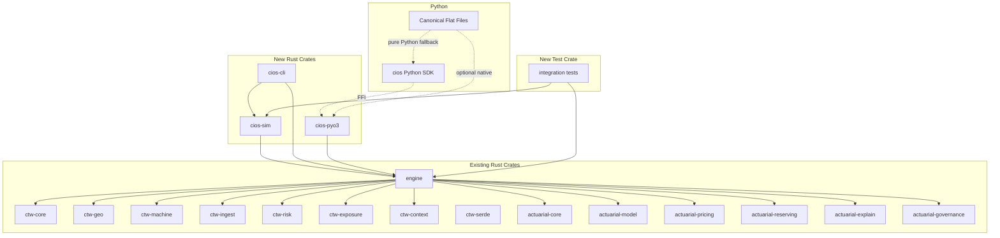

# Master Plan: FFI, CLI, Simulation, Integration Tests, Python SDK & Canonical Flat Files

## Executive Summary

Six workstreams extend the Construction Insurance OS from a Rust library
into a full-stack platform accessible from Python, the command line, and
automated test pipelines — anchored by **canonical flat files** that serve as
the primary developer on-ramp.

| Workstream | Artifact | Crate / Package | Detail Plan |
|-----------|----------|-----------------|-------------|
| PyO3 FFI Bindings | Native Python extension `_cios_core` | `crates/cios-pyo3` | [pyo3-ffi-bindings.md](pyo3-ffi-bindings.md) |
| CLI Binary | `cios` command-line tool | `crates/cios-cli` | [cli-binary.md](cli-binary.md) |
| Simulation / Mock Data | Deterministic data generators | `crates/cios-sim` | [simulation-mock-data.md](simulation-mock-data.md) |
| Integration Tests | End-to-end pipeline tests | `tests/integration` | [integration-tests.md](integration-tests.md) |
| Python SDK | `cios` PyPI package | `python/cios` | [python-sdk.md](python-sdk.md) |
| Canonical Flat Files | Self-contained end-to-end examples | `python/examples/` | [canonical-flat-files.md](canonical-flat-files.md) |

## Workspace After Completion

```
construction-insurance-os/
├── Cargo.toml                    # workspace root
├── crates/
│   ├── ctw-core/                 # (existing) no_std core types
│   ├── ctw-geo/                  # (existing) geometry
│   ├── ctw-machine/              # (existing) machine types
│   ├── ctw-ingest/               # (existing) telemetry ingestion
│   ├── ctw-risk/                 # (existing) risk detection
│   ├── ctw-exposure/             # (existing) exposure measurement
│   ├── ctw-context/              # (existing) context types
│   ├── ctw-serde/                # (existing) serde bridges
│   ├── actuarial-core/           # (existing) insurance domain types
│   ├── actuarial-model/          # (existing) GLM fitting
│   ├── actuarial-pricing/        # (existing) pricing pipeline
│   ├── actuarial-reserving/      # (existing) loss reserving
│   ├── actuarial-explain/        # (existing) explainability
│   ├── actuarial-governance/     # (existing) governance/filing
│   ├── engine/                   # (existing) pipeline orchestration
│   ├── cios-sim/                 # NEW — simulation generators
│   ├── cios-cli/                 # NEW — CLI binary
│   └── cios-pyo3/               # NEW — PyO3 FFI bindings
├── tests/
│   └── integration/              # NEW — cross-pipeline integration tests
├── python/
│   ├── pyproject.toml            # NEW — Python SDK package config
│   ├── cios/                     # NEW — Python SDK source
│   │   └── cli/
│   │       ├── unflatten.py      # NEW — flat → SDK module tree
│   │       └── flatten.py        # NEW — SDK → flat file reassembly
│   └── examples/                 # NEW — canonical flat files
│       ├── cios_fleet_90d.py     #   Primary use case (v0.3.0)
│       ├── cios_single_crane.py  #   Crane-specific
│       ├── cios_highway_civil.py #   Highway construction
│       └── ...                   #   (7 use-case files total)
└── plans/                        # These plan documents
```

## Dependency Graph



## Build Order

The workstreams have dependencies that dictate a natural build order:

```
Phase 1: cios-sim           (no upstream new deps — only depends on engine)
    │
Phase 2: cios-cli           (depends on cios-sim for simulate commands)
    │     integration tests  (depends on cios-sim for test data)
    │
Phase 3: cios-pyo3          (depends on engine — can start in Phase 1)
    │
Phase 4: Python SDK          (depends on cios-pyo3 being built)
    │     Canonical Flat Files (works pure-Python; optionally uses cios-pyo3)
```

Phases 1-3 can be parallelized since `cios-sim`, `cios-pyo3`, and the
integration tests only share the `engine` crate as a common dependency.

> **Note:** Canonical flat files work in **pure Python mode** with no Rust
> dependency (numpy/scipy only). When `_cios_core` is installed, they
> transparently delegate compute-heavy steps to the Rust engine. This means
> flat files can be developed and tested even before Phase 3 completes.

## Recommended Implementation Sequence

### Phase 1 — Foundations
- [ ] Create `crates/cios-sim` with all generators
- [ ] Add `cios-sim` to workspace `Cargo.toml`
- [ ] Validate generators produce domain-valid data with unit tests

### Phase 2a — CLI
- [ ] Create `crates/cios-cli` with clap command tree
- [ ] Implement all subcommands delegating to engine + cios-sim
- [ ] Add `assert_cmd` integration tests for CLI

### Phase 2b — Integration Tests
- [ ] Create `tests/integration` crate
- [ ] Implement layer boundary tests using cios-sim data
- [ ] Implement full pipeline test + determinism test
- [ ] Implement edge case + serde round-trip tests
- [ ] Create baseline snapshots

### Phase 3 — PyO3 FFI
- [ ] Create `crates/cios-pyo3` with maturin build
- [ ] Implement type wrappers and function bindings
- [ ] Verify native module loads in Python

### Phase 4a — Python SDK
- [ ] Create `python/cios` package
- [ ] Implement typed dataclass models
- [ ] Implement module wrappers calling into `_cios_core`
- [ ] Implement Pipeline orchestrator
- [ ] Implement DataFrame interop for reserving
- [ ] Implement `unflatten.py` and `flatten.py` CLI tools
- [ ] Write pytest test suite
- [ ] Generate type stubs

### Phase 4b — Canonical Flat Files
- [ ] Create `python/examples/cios_fleet_90d.py` (v0.3.0 with native fallback)
- [ ] Create additional use-case flat files (crane, highway, urban, autonomous, renewal, catastrophe)
- [ ] Add CI job that runs every flat file and verifies deterministic output
- [ ] Write `docs/flat-file-workflow.md` documenting the pattern

## Root Cargo.toml Changes

The following members need to be added to the workspace:

```toml
[workspace]
members = [
    # ... existing members ...
    "crates/cios-sim",
    "crates/cios-cli",
    "crates/cios-pyo3",
    "tests/integration",
]

[workspace.dependencies]
# ... existing deps ...
cios-sim = { path = "crates/cios-sim" }
rand = "0.8"
rand_distr = "0.4"
clap = { version = "4", features = ["derive", "env"] }
pyo3 = { version = "0.22", features = ["extension-module"] }
```

## Key Technical Decisions

| Decision | Choice | Rationale |
|----------|--------|-----------|
| FFI strategy | PyO3 direct | Most mature Rust-Python bridge; maturin handles wheel building |
| Complex type marshalling | JSON via serde | Avoids maintaining parallel struct hierarchies for deeply nested enums |
| Hot-path type marshalling | Native `#[pyclass]` | Zero-copy for frequently accessed types like FittedGlm |
| CLI framework | clap v4 derive | Industry standard; compile-time validation of args |
| RNG for simulation | `rand::StdRng` with explicit seed | Deterministic, portable across platforms |
| Python DataFrame interop | Optional pandas/polars | Keeps core SDK zero-dependency |
| Test data | cios-sim crate | Single source of truth for synthetic data across Rust tests and CLI |
| Developer on-ramp | Canonical flat files | Single file = complete workflow; no multi-file setup confusion |
| Flat file native support | Optional Rust fallback | `try: import _cios_core` pattern — pure Python always works |
| Flat ↔ SDK workflow | Bidirectional unflatten/flatten | Developers start flat, unflatten to production, flatten back for review |

## Risk Mitigation

| Risk | Mitigation |
|------|-----------|
| PyO3 version churn | Pin PyO3 version in workspace deps; test against Python 3.10-3.13 |
| GIL contention on model fitting | Wrap IRLS loop in `py.allow_threads` |
| Cross-platform wheel builds | Use `maturin` with GitHub Actions matrix for all targets |
| `no_std` types lack serde in FFI | Engine crate already enables `serde` feature on all ctw crates |
| Large triangle data through FFI | Accept flat `list[list[float]]` — avoid numpy dependency for reserving |
| Test brittleness from floating point | Use `approx` crate with explicit tolerances; snapshot tests use rounded values |
