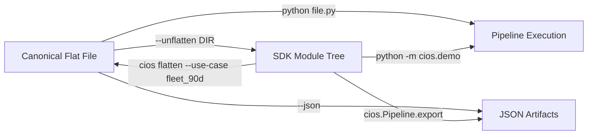

# Plan: Canonical Flat Files — Self-Contained Developer Workflow

## Overview

A **canonical flat file** is a single Python file that contains an entire
end-to-end use case — from dependency check through telemetry generation,
risk detection, GLM fitting, pricing, reserving, explainability, and governance
filing. It is simultaneously:

1. **Executable example** — `python cios_fleet_90d.py` runs the complete pipeline
2. **Living documentation** — numbered step comments explain every decision
3. **Configuration template** — `# ← CHANGE THIS` markers and a top-level `Config`
   dataclass tell the user exactly what to customize
4. **SDK scaffold seed** — `--unflatten DIR` splits the file into the full SDK
   module tree, ready for production use

This pattern already exists in two versions:
- [`construction_insurance_complete.py`](../Downloads/construction_insurance_complete.py) — v0.1.0-flat, 953 lines
- [`construction_insurance_complete_v0_2_0_flat.py`](../Downloads/construction_insurance_complete_v0_2_0_flat.py) — v0.2.0-flat, 1712 lines

The plan formalizes this into a first-class SDK feature with multiple use-case
flat files, Rust-backed native acceleration, and a bidirectional flat↔SDK workflow.

## Design Principles

1. **One file, start to finish** — The developer opens a single file, modifies
   the `Config` block, and runs. No imports to chase, no multi-file setup.
2. **Comments are documentation** — Numbered steps with explanatory comments
   mean the developer never needs to leave the file for reference.
3. **Progressive disclosure** — The `Config` at the top is simple. The math
   below is there if you want to read it, but you don't have to.
4. **Round-trip fidelity** — Unflatten a flat file into SDK modules; later,
   flatten an SDK project back into a single file for sharing/review.

## Anatomy of a Canonical Flat File

```
┌─────────────────────────────────────────────────────────────────────┐
│ HEADER BANNER                                                       │
│  - Version, license, use case description                           │
│  - HOW TO USE THIS FILE (4-step instructions)                       │
│  - Dependency list                                                  │
├─────────────────────────────────────────────────────────────────────┤
│ STEP 0: DEPENDENCIES AND ENVIRONMENT CHECK                          │
│  [MODULE: sdk/doctor.py]                                            │
│  doctor() function — fail-fast if numpy/pandas/scipy missing        │
├─────────────────────────────────────────────────────────────────────┤
│ STEP 1: CORE TYPES AND UNITS                                        │
│  [MODULE: sdk/core/types.py]                                        │
│  Enums, dataclasses mirroring Rust ctw-core types                   │
├─────────────────────────────────────────────────────────────────────┤
│ STEP 1.5: EDIT HERE FIRST — CONFIG SURFACE                          │
│  [MODULE: sdk/config.py]                                            │
│  @dataclass Config with all user-tunable parameters                 │
│  ← CHANGE THIS markers on every field                               │
├─────────────────────────────────────────────────────────────────────┤
│ STEP 2: PRODUCT DESIGN — COVERAGE                                   │
│  [MODULE: sdk/product/coverage.py]                                  │
│  CoverageForm, DeductibleStructure, LimitStructure                  │
├─────────────────────────────────────────────────────────────────────┤
│ STEP 2.5: VALIDATION AND SERIALIZATION                              │
│  [MODULE: sdk/core/validation.py]                                   │
│  validate_config(), to_jsonable(), require_columns()                │
├─────────────────────────────────────────────────────────────────────┤
│ STEP 3: SYNTHETIC DATA GENERATION                                   │
│  [MODULE: sdk/mock/site_generator.py]                               │
│  Fleet config, telemetry generator — seed-deterministic             │
├─────────────────────────────────────────────────────────────────────┤
│ STEP 4: RISK EVENT DETECTION                                        │
│  [MODULE: sdk/risk/detectors.py]                                    │
│  8 detectors: harsh decel, proximity, geofence, swing, etc.         │
├─────────────────────────────────────────────────────────────────────┤
│ STEP 5: FEATURE ENGINEERING — X, E, C BUNDLE                        │
│  [MODULE: sdk/risk/features.py]                                     │
│  BehaviorFeatures, ExposureFeatures, ContextFeatures, RiskBundle    │
├─────────────────────────────────────────────────────────────────────┤
│ STEP 6: SYNTHETIC CLAIMS                                            │
│  [MODULE: sdk/mock/claims_generator.py]                             │
│  Claims correlated with risk event severity                         │
├─────────────────────────────────────────────────────────────────────┤
│ STEP 7: GLM LOSS MODELING                                           │
│  [MODULE: sdk/models/loss_cost.py]                                  │
│  Poisson IRLS (frequency) + Gamma IRLS (severity) + predict         │
├─────────────────────────────────────────────────────────────────────┤
│ STEP 8: EXPENSE AND PROFIT LOADING                                  │
│  [MODULE: sdk/pricing/expense_loading.py]                           │
│  Premium = (Loss + LAE) / (1 - V - Q)                               │
├─────────────────────────────────────────────────────────────────────┤
│ STEP 9: CREDIBILITY AND EXPERIENCE RATING                           │
│  [MODULE: sdk/pricing/credibility.py]                               │
│  Bühlmann Z, behavioral blend, floor/ceiling                        │
├─────────────────────────────────────────────────────────────────────┤
│ STEP 10: FINAL PREMIUM                                              │
│  [MODULE: sdk/pricing/premium.py]                                   │
│  Combine gross × modifier, apply minimum                            │
├─────────────────────────────────────────────────────────────────────┤
│ STEP 11: RESERVING — LOSS TRIANGLES AND IBNR                        │
│  [MODULE: sdk/reserving/triangle.py]                                │
│  Build triangle, chain-ladder, compute IBNR                         │
├─────────────────────────────────────────────────────────────────────┤
│ STEP 12: EXPLAINABILITY                                             │
│  [MODULE: sdk/explain/attribution.py]                               │
│  Per-feature contributions, counterfactuals                         │
├─────────────────────────────────────────────────────────────────────┤
│ STEP 13: GOVERNANCE — RATE FILING ARTIFACT                          │
│  [MODULE: sdk/governance/filing.py]                                 │
│  Rating factors, SHA-256 hash, diagnostics                          │
├─────────────────────────────────────────────────────────────────────┤
│ STEP 14: DASHBOARD RENDERING                                        │
│  [MODULE: sdk/render/terminal.py]                                   │
│  ASCII dashboard with circled-number sections                       │
├─────────────────────────────────────────────────────────────────────┤
│ STEP 15: PIPELINE ARTIFACTS CONTAINER                               │
│  [MODULE: sdk/core/artifacts.py]                                    │
│  PipelineArtifacts — holds all intermediate + final results         │
├─────────────────────────────────────────────────────────────────────┤
│ STEP 16: UNFLATTEN                                                  │
│  [MODULE: sdk/cli/unflatten.py]                                     │
│  Parse [MODULE:] markers, split into package, write pyproject.toml  │
├─────────────────────────────────────────────────────────────────────┤
│ STEP 17: MAIN — sdk.demo()                                          │
│  Orchestrate all steps, return PipelineArtifacts                    │
│  if __name__ == "__main__": argparse --unflatten / --json           │
└─────────────────────────────────────────────────────────────────────┘
```

## Flat File Conventions

### Section Markers

Every section is bounded by `═══` separator lines and tagged with metadata:

```python
# ═══════════════════════════════════════════════════════════════════════════════
# STEP N: TITLE — optional workstream reference
# Description of what this step does and why.
# [MODULE: sdk/path/to/module.py]
# ═══════════════════════════════════════════════════════════════════════════════
```

### Change Markers

User-customizable values are tagged with `# ← CHANGE THIS`:

```python
commission: float = 0.10              # ← CHANGE THIS
```

### Module Annotations

`[MODULE: sdk/path/module.py]` tells the unflattener where to place each section:

```python
# [MODULE: sdk/pricing/expense_loading.py]
```

### Config Surface (v0.2.0+)

A single `@dataclass Config` at the top contains **all** user-tunable knobs.
The rest of the file reads from `config.*` — no scattered magic constants.

## Planned Use-Case Flat Files

| Flat File | Use Case | Config Focus |
|-----------|----------|--------------|
| `cios_fleet_90d.py` | Mixed fleet, 2 sites, 90 days — the current demo | Fleet composition, thresholds |
| `cios_single_crane.py` | Single crawler crane, lift operations | Crane-specific perils, load monitoring |
| `cios_highway_civil.py` | Highway construction, haul trucks + dozers | High slope, long haul distances |
| `cios_urban_excavation.py` | Dense urban site, high worker density | Proximity thresholds, night ops |
| `cios_autonomous_fleet.py` | Mostly autonomous fleet, comparing manual vs auto | Control mode mix, autonomous discount |
| `cios_renewal_pricing.py` | Renewal with prior-year experience data | Credibility weighting, loss history |
| `cios_catastrophe_scenario.py` | Simulating a catastrophe year | Cat load calibration, reserve adequacy |

Each flat file:
- Is self-contained and runnable
- Has a different `Config` default reflecting its use case
- Covers the same end-to-end pipeline (same steps 0-17)
- Uses the same `[MODULE:]` annotations (unflatten produces the same SDK structure)

## Flat ↔ SDK Bidirectional Workflow



### Unflatten (flat → SDK)

Already implemented in v0.1.0 and v0.2.0. Parses `[MODULE:]` markers, splits
code into files, writes `__init__.py` files and `pyproject.toml`.

### Flatten (SDK → flat) — New

The reverse operation: given an SDK module tree, reassemble into a single flat
file. This enables a workflow where:

1. Developer starts with a flat file
2. Unflatten into SDK when ready for production
3. Make changes in the SDK module tree
4. Flatten back into a single file for code review / sharing / onboarding

```python
# CLI: cios flatten --use-case fleet_90d --output cios_fleet_90d.py
# SDK: from cios.cli.flatten import flatten; flatten("fleet_90d", "output.py")
```

## Native Acceleration Integration

When the Rust native extension (`_cios_core` from `cios-pyo3`) is available,
the flat file can optionally delegate compute-heavy steps to Rust:

```python
# In STEP 0, after doctor():
try:
    import _cios_core
    NATIVE = True
except ImportError:
    NATIVE = False

# In STEP 7, GLM fitting:
if NATIVE:
    fm = _cios_core.fit_poisson_glm(X, y, offset=offset, feature_names=names)
else:
    fm = _poisson_irls(X, y, offset=offset)  # pure Python fallback
```

This means the flat file works in two modes:
- **Pure Python** — no compilation needed, numpy/scipy only
- **Rust-accelerated** — 10-100× faster GLM fitting, native type validation

## v0.3.0-flat — Planned Improvements Over v0.2.0

| Improvement | Description |
|------------|-------------|
| Native fallback | Detect `_cios_core` and use Rust engine when available |
| Config from TOML/JSON | `Config.from_file("config.toml")` in addition to dataclass |
| Multiple scenarios | `Config.fleet_90d()`, `Config.single_crane()`, etc. class methods |
| Flatten command | Reverse of unflatten — SDK → flat file |
| Type stubs inline | `if TYPE_CHECKING:` block at top with Protocol definitions |
| Progress bar | Optional `rich` progress bar during telemetry generation |
| Snapshot testing | `--snapshot` flag to save/compare output against baseline |
| Config diff | `--diff` flag to show what changed from defaults |

## Implementation Steps

1. Copy v0.2.0-flat into `python/examples/cios_fleet_90d.py` as the canonical baseline
2. Add native acceleration fallback to every compute-heavy step
3. Add `Config.from_file()` for TOML/JSON config loading
4. Add `Config.fleet_90d()`, `Config.single_crane()`, etc. class methods
5. Implement the `flatten` command (reverse of unflatten)
6. Create additional use-case flat files from the table above
7. Add `--snapshot` and `--diff` CLI flags
8. Wire flat files into the SDK's test suite (each flat file = integration test)
9. Add CI job that runs every flat file and verifies deterministic output
10. Document the flat file workflow in `python/docs/flat-file-workflow.md`

## File Locations in the Project

```
python/
├── examples/
│   ├── cios_fleet_90d.py              # Primary canonical flat file (v0.3.0)
│   ├── cios_single_crane.py           # Crane-specific use case
│   ├── cios_highway_civil.py          # Highway construction
│   ├── cios_urban_excavation.py       # Dense urban site
│   ├── cios_autonomous_fleet.py       # Autonomous fleet comparison
│   ├── cios_renewal_pricing.py        # Renewal with experience data
│   └── cios_catastrophe_scenario.py   # Catastrophe year simulation
├── cios/
│   ├── cli/
│   │   ├── unflatten.py               # Shared unflatten logic
│   │   └── flatten.py                 # SDK → flat file reassembly
│   └── ...
└── ...
```
