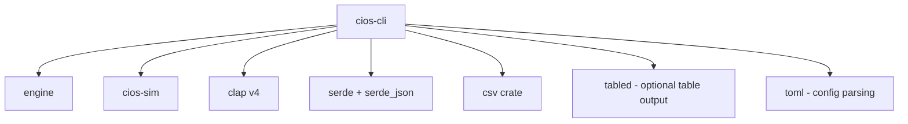

# Plan: CLI Binary — `crates/cios-cli`

## Overview

A `clap`-based command-line binary that exposes the full engine as a
first-class CLI tool. Supports JSON/CSV input, structured output, and
interactive pipeline composition. Designed for actuaries running ad-hoc
analyses, CI pipelines validating model artifacts, and ops scripts.

## Crate Layout

```
crates/cios-cli/
├── Cargo.toml
├── src/
│   ├── main.rs             # Entry point, root clap app
│   ├── commands/
│   │   ├── mod.rs
│   │   ├── model.rs        # fit, predict, diagnostics
│   │   ├── price.rs        # expense-load, credibility, premium
│   │   ├── reserve.rs      # triangle, chain-ladder
│   │   ├── explain.rs      # explain-prediction
│   │   ├── filing.rs       # generate-filing, validate-filing
│   │   ├── simulate.rs     # generate mock data (delegates to cios-sim)
│   │   └── pipeline.rs     # run full pipeline end-to-end
│   ├── output.rs           # JSON/table/CSV formatters
│   └── config.rs           # TOML/JSON config file loading
```

## Command Tree

```
cios
├── model
│   ├── fit          --family poisson --features data.csv -o model.json
│   ├── predict      --model model.json --features '[1.0, 0.5, ...]'
│   └── diagnostics  --model model.json
├── price
│   ├── expense-load --pure-premium 4200 --assumptions assumptions.json
│   ├── credibility  --exposure-hours 25000 --actual-losses 80000 ...
│   └── premium      --gross 5600 --exp-mod 0.92 --exposure-hours 25000
├── reserve
│   ├── triangle     --input triangle.csv --format cumulative
│   └── chain-ladder --input triangle.csv
├── explain
│   └── prediction   --model model.json --features '[1.0, 0.5, ...]'
├── filing
│   ├── generate     --model model.json --effective 2026-07-01 --territory CA
│   └── validate     --filing filing.json  (verify hash, schema)
├── simulate
│   ├── fleet        --machines 50 --days 365 --seed 42
│   ├── claims       --policies 200 --frequency 0.05 --seed 42
│   └── triangle     --origins 10 --development 10 --seed 42
├── pipeline
│   └── run          --config pipeline.toml
└── version
```

## Dependency Graph



## Output Modes

Every command supports `--output-format`:

| Format | Flag | Description |
|--------|------|-------------|
| JSON | `--output-format json` (default) | Machine-readable structured output |
| Table | `--output-format table` | Human-readable ASCII table |
| CSV | `--output-format csv` | Flat CSV rows |
| Pretty | `--output-format pretty` | Colorized human-readable summary |

## Configuration

A `pipeline.toml` for the `pipeline run` command:

```toml
[data]
telemetry = "fleet_data.csv"
claims = "claims.csv"

[model]
family = "poisson"
features = ["harsh_decel_rate", "worker_proximity_rate", "night_fraction"]

[pricing]
expense_assumptions = "defaults"
credibility_exposure = 50000

[filing]
effective_date = "2026-07-01"
territory = "CA"
```

## Cargo.toml Skeleton

```toml
[package]
name = "cios-cli"
version.workspace = true
edition.workspace = true

[[bin]]
name = "cios"
path = "src/main.rs"

[dependencies]
engine = { workspace = true }
cios-sim = { path = "../cios-sim" }
clap = { version = "4", features = ["derive", "env"] }
serde = { workspace = true }
serde_json = { workspace = true }
toml = "0.8"
csv = "1.3"
anyhow = { workspace = true }
chrono = { workspace = true }

[dev-dependencies]
assert_cmd = "2"
predicates = "3"
tempfile = "3"
```

## Implementation Steps

1. Create `crates/cios-cli/` directory and `Cargo.toml`
2. Add `cios-cli` to workspace members
3. Scaffold `main.rs` with root `clap::Parser` and subcommands
4. Implement `output.rs` — JSON/table/CSV formatting trait
5. Implement `config.rs` — TOML config loading
6. Implement `commands/model.rs` — fit, predict, diagnostics
7. Implement `commands/price.rs` — expense-load, credibility, premium
8. Implement `commands/reserve.rs` — triangle input + chain-ladder
9. Implement `commands/explain.rs` — prediction explanation
10. Implement `commands/filing.rs` — generate + validate
11. Implement `commands/simulate.rs` — delegates to `cios-sim`
12. Implement `commands/pipeline.rs` — full pipeline orchestration
13. Add `assert_cmd` integration tests for every subcommand
14. Add shell completion generation via `clap_complete`
