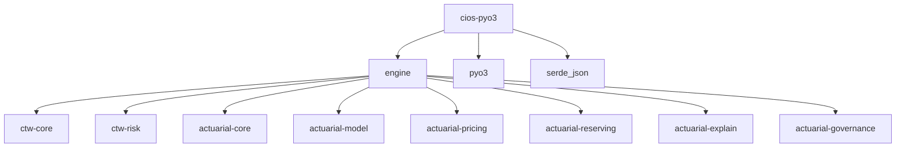

# Plan: PyO3 FFI Bindings — `crates/cios-pyo3`

## Overview

A new workspace crate that exposes the Rust engine to Python via [PyO3](https://pyo3.rs).
The crate compiles into a native Python extension module (`_cios_core`) that the
higher-level Python SDK imports.

## Design Principles

1. **Thin bridge** — PyO3 wrapper types should delegate to the real Rust types;
   no business logic lives in the FFI layer.
2. **Serde round-trip** — For complex nested types, accept/return JSON strings
   via `serde_json` rather than manually mapping every field. Provide typed
   wrappers for the hot-path types only.
3. **Error mapping** — Map `ActuarialError`, `CoreError`, and `anyhow::Error`
   into a unified Python `CiosError` exception hierarchy.
4. **GIL-free compute** — Release the GIL (`py.allow_threads`) for all
   expensive operations (GLM fitting, chain-ladder, premium calc).

## Crate Layout

```
crates/cios-pyo3/
├── Cargo.toml
├── pyproject.toml          # maturin build config
├── src/
│   ├── lib.rs              # #[pymodule] _cios_core
│   ├── errors.rs           # Python exception classes
│   ├── ids.rs              # PyMachineId, PySiteId, etc.
│   ├── types_core.rs       # PyPolicy, PyClaim, PyExposureBundle
│   ├── types_risk.rs       # PyRiskEvent, PyRiskEventType
│   ├── model.rs            # PyFittedGlm, fit_poisson_glm, fit_gamma_glm
│   ├── pricing.rs          # expense loading, credibility, premium calc
│   ├── reserving.rs        # PyLossTriangle, chain_ladder
│   ├── explain.rs          # explain_prediction, counterfactuals
│   ├── governance.rs       # generate_filing
│   └── pipeline.rs         # High-level orchestration entry points
```

## Dependency Graph



## Type Mapping Strategy

| Rust Type | Python Exposure | Strategy |
|-----------|----------------|----------|
| `MachineId`, `SiteId`, etc. | `PyMachineId` with `__repr__`, `__eq__`, `__hash__` | Newtype wrapper |
| `Policy`, `Claim` | `PyPolicy`, `PyClaim` | Field-by-field `#[pyclass]` |
| `FittedGlm` | `PyFittedGlm` | `#[pyclass]` with method wrappers |
| `LossTriangle` | `PyLossTriangle` | Accept nested lists from Python |
| `RiskEvent`, `EventDetails` | JSON round-trip | `serde_json` — too many variants for manual mapping |
| `ExposureBundle` | `PyExposureBundle` | `#[pyclass]` with `#[pyo3(get)]` |
| `PremiumResult` | `PyPremiumResult` | `#[pyclass]` with `#[pyo3(get)]` |
| `ExpenseAssumptions` | `PyExpenseAssumptions` | `#[pyclass]` with `#[pyo3(get, set)]` for mutability |
| `RateFilingArtifact` | JSON string | `serde_json` |

## Key Functions to Expose

### Model Fitting
- `fit_poisson_glm(features: numpy.ndarray, response: numpy.ndarray, ...) -> PyFittedGlm`
- `fit_gamma_glm(features: numpy.ndarray, response: numpy.ndarray, ...) -> PyFittedGlm`
- `predict_mu(model: PyFittedGlm, features: list[float]) -> float`

### Pricing Pipeline
- `apply_expense_loading(pure_premium: float, assumptions: PyExpenseAssumptions) -> PyExpenseLoadedPremium`
- `compute_experience_modifier(...) -> PyExperienceModifier`
- `calculate_final_premium(...) -> PyPremiumResult`

### Reserving
- `chain_ladder(triangle: list[list[float]], origins: list[str]) -> PyChainLadderResult`

### Explainability
- `explain_prediction(model: PyFittedGlm, features: list[float]) -> list[dict]`

### Governance
- `generate_filing(effective_date: str, territory: str, base_rate: float, model: PyFittedGlm) -> str`

### Pipeline
- `run_full_pipeline(config_json: str) -> str` — end-to-end JSON-in/JSON-out

## Cargo.toml Skeleton

```toml
[package]
name = "cios-pyo3"
version.workspace = true
edition.workspace = true

[lib]
name = "_cios_core"
crate-type = ["cdylib"]

[dependencies]
engine = { workspace = true }
pyo3 = { version = "0.22", features = ["extension-module"] }
serde_json = { workspace = true }
serde = { workspace = true }
anyhow = { workspace = true }

# Optional numpy interop
numpy = "0.22"
```

## Build Tooling

- Use **maturin** for building the native wheel
- `pyproject.toml` with `[build-system] requires = ["maturin>=1.5"]`
- CI produces wheels for `manylinux2014`, `macosx-arm64`, `macosx-x86_64`, `win-amd64`

## Implementation Steps

1. Create `crates/cios-pyo3/` directory and `Cargo.toml`
2. Add `cios-pyo3` to workspace members in root `Cargo.toml`
3. Implement `errors.rs` — `CiosError` Python exception
4. Implement `ids.rs` — ID newtype wrappers
5. Implement `types_core.rs` — Policy, Claim, ExposureBundle
6. Implement `model.rs` — FittedGlm wrapper + fit functions
7. Implement `pricing.rs` — expense, credibility, premium
8. Implement `reserving.rs` — triangle + chain-ladder
9. Implement `explain.rs` — prediction explanation
10. Implement `governance.rs` — filing generation
11. Implement `pipeline.rs` — orchestration
12. Wire everything into `lib.rs` `#[pymodule]`
13. Create `pyproject.toml` for maturin
14. Add smoke tests in `tests/` that call Python from Rust
